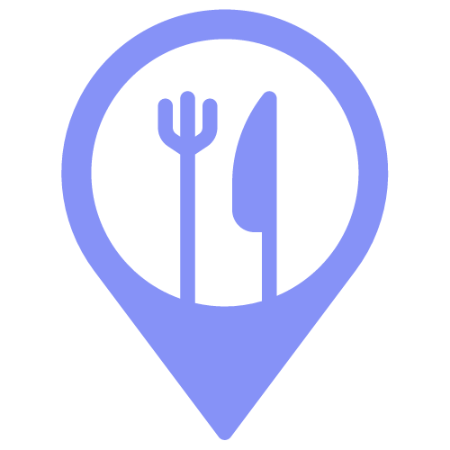

# RestoNearby

    

Resto Nearby adalah sebuah aplikasi Android yang memanfaatkan sensor di perangkat Android dan Google Maps API. Aplikasi ini dirancang untuk membantu pengguna menemukan 5 lokasi tempat makan favorit terdekat dari lokasi pengguna saat aplikasi digunakan. Aplikasi ini diharapkan dapat memberikan pengalaman yang nyaman dan membantu pengguna menemukan tempat makan favorit terdekat dengan mudah. Dengan memanfaatkan sensor di perangkat Android dan Google Maps API, pengguna dapat mengetahui lokasi mereka secara real-time dan menavigasi ke tempat makan dengan mudah.